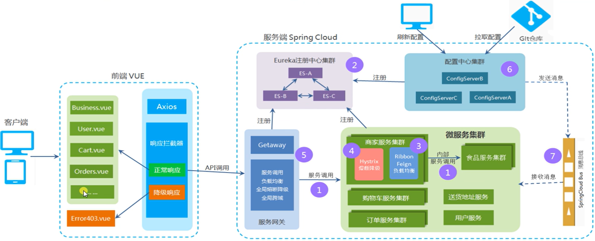

## 一. 启动此项目前期准备:

### 1.修改本机hosts文件

打开本机的 C:\Windows\System32\drivers\etc\hosts 文件,  添加映射信息

```springcloud 配置
127.0.0.1 eurekaServer13000
127.0.0.1 eurekaServer13001
```

测试: 启动Eureka集群服务, 在浏览器地址栏中输入: http://localhost:13000/ 和 http://localhost:13001 , 检查Eureka服务是否已经互相注册成功.

### 2.IDEA中默认同时启动最多5个应用,不能满足此项目需求,应在setting中修改最大同时启动应用数 

具体方法: 

```修改最大同时启动应用数
File -> Settings -> 搜索"temporary configuration limit" -> Advanced Settings -> 修改Temporary configurations limit为50 -> Apply -> OK
```

### 3.安装erlang与rabbitmq

具体可参考:   [Windows下Erlang和RabbitMQ下载安装教程 - show-code - 博客园](https://www.cnblogs.com/xing-nb/p/15204526.html)  , 要确保rabbitmq是运行状态.

## 二. 饿了么 SpringCloud 版项目安装环境部署指南

饿了么 SpringCloud 版项目是采用了 VUE-CLI+SpringCloud 开发的前后端分离的微服务项目。

**1.** **简介**

**1.1** **项目前端技术架构：**

1) VUE-CLI 

**1.2** **项目后端技术架构**

1) JDK 1.8 
2) SpringCloud 
3) MyBatis 
4) MySQL 
5) Maven 

**1.3** **开发工具**

1) 前端项目：vscode
2) 后端项目：STS（spring-tool-suite）
3) mysql-5.5.62-winx64 
4) Navicat Premium 8 
5) Maven 

**2.安装部署指南**

**2.1** **后端项目部署**

1) 安装 jdk、Maven、STS、MySql
2) 在 mysql 数据库中创建数据库 elm，使用数据库脚本 elm.sql 创建数据库和初始数据。

3) 在 STS 中导入 SpringCloud 项目。
4) 打开 SpringBoot 配置文件 application.yml 修改数据库密码
5) 运行 MyApplication

**2.2** **前端项目部署**

1) 安装 Node.js（也就是安装 npm）、安装 Vue-Cli
2) 首先将前端工程导入到 hbuilder 中
3) 切换到项目路径下，使用 npm 安装依赖: npm install, 安装成功后，在项目文件夹下出现 node_modules 文件夹，里面是项目依赖。

4) 启动项目 npm run serve
5) 在浏览器中输入网址 http://localhost:8081，进入首页

## 三. 项目架构图



```微服务项目与本机端口对应关系
| 微服务      | 端口1 | 端口2     |
| :---        |    :----:   |          ---: |
| user | 10100 | 10101 |
| food | 10200 | 10201 |
| business      | 10300       | 10301   |
| cart   | 10400        | 10401      |
| deliveryaddress | 10500 | 10501 |
| orders | 10600 | 10601 |
| chats | 10700 | 10701 |
| favorite | 10800 | 10801 |
| likes | 10900 | 10901 |
| remark | 11000 | 11001 |
| search | 11100 | 11101 | 
| credit | 11200 | 11201 |
| virtualwallet | 11300 | 11301 |
| eureka | 13000 | 13001 |
| gateway | 14000 | |
| config | 15000 | 15001 |
```

