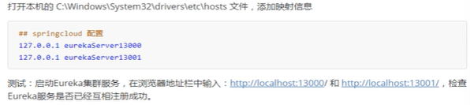
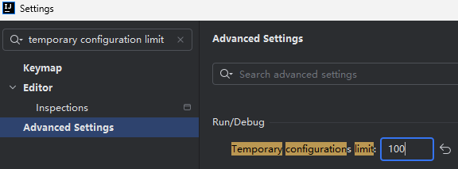

### 前期准备:

### 1.修改本机hosts文件

### 2.IDEA中默认同时启动最多应用数为5个,不能满足此项目需求,在setting中修改 

### 3.安装erlang与rabbitmq

具体参考:

### 饿了么 SpringCloud 版项目安装环境部署指南

饿了么 SpringCloud 版项目是采用了 VUE-CLI+SpringCloud 开发的前后端分离的微服务项目。

**1.** **简介**

**1.1** **项目前端技术架构：**

1) VUE-CLI 

**1.2** **项目后端技术架构**

1) JDK 1.8 
2) SpringCloud 
3) MyBatis 
4) MySQL 
5) Maven 

**1.3** **开发工具**

1) 前端项目：vscode
2) 后端项目：STS（spring-tool-suite）
3) mysql-5.5.62-winx64 
4) Navicat Premium 8 
5) Maven **2.****安装部署指南**

**2.1** **后端项目部署**

1) 安装 jdk、Maven、STS、MySql
2) 在 mysql 数据库中创建数据库 elm，使用数据库脚本 elm.sql 创建数据库和初始数据。

3) 在 STS 中导入 SpringCloud 项目。
4) 打开 SpringBoot 配置文件 application.yml 修改数据库密码
5) 运行 MyApplication

**2.2** **前端项目部署**

1) 安装 Node.js（也就是安装 npm）、安装 Vue-Cli
2) 首先将前端工程导入到 hbuilder 中
3) 切换到项目路径下，使用 npm 安装依赖: npm install, 安装成功后，在项目文件夹下出现 node_modules 文件夹，里面是项目依赖。

4) 启动项目 npm run serve
5) 在浏览器中输入网址 http://localhost:8081，进入首页